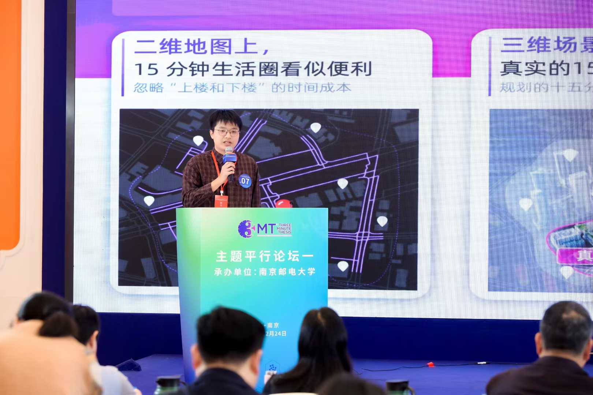

It was a great honor to represent my university at the Jiangsu Graduate Academic Forum and share our recent research published in *Cities*. In this work, we proposed the concept of the **Vertical 15-Minute City**, extending the traditional 15-minute city framework into the vertical dimension of urban space.

By integrating multi-source urban data, we predicted urban functions at the floor level and formally incorporated **stair travel time and elevator travel time** into accessibility analysis. Our findings reveal that conventional two-dimensional accessibility assessments can systematically overestimate real-world accessibility when vertical mobility is ignored.

The forum emphasized interdisciplinary exchange and adopted the **Three-Minute Thesis (3MT)** format for presentations. Communicating complex urban analytics within such a constrained timeframe was both challenging and rewarding. The cross-disciplinary audience and diverse perspectives sparked many insightful discussions and offered valuable reflections on how urban research can be made more accessible to broader audiences.

I got to meet many talented graduate students from various fields, and the experience has inspired me to continue exploring innovative ways to communicate urban research effectively. Moreover, I got **excellent academic presentation** in this competition.

If you are interested in learning more about the Vertical 15-Minute City concept, feel free to reach out or check out our published paper in [Cities](https://doi.org/10.1016/j.cities.2025.106516).

