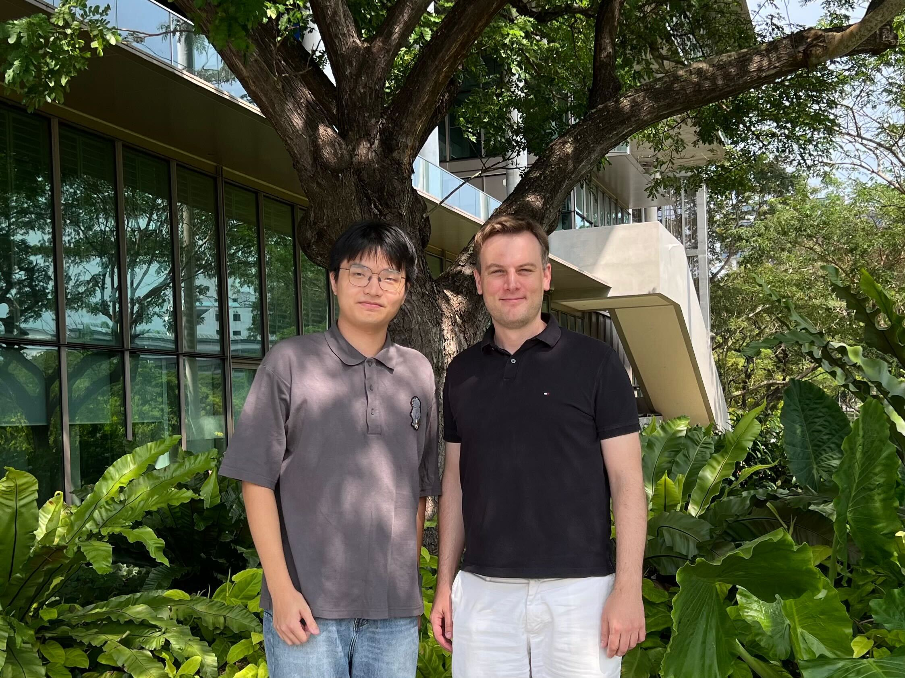
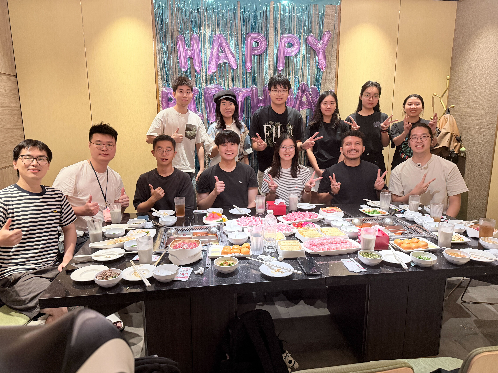
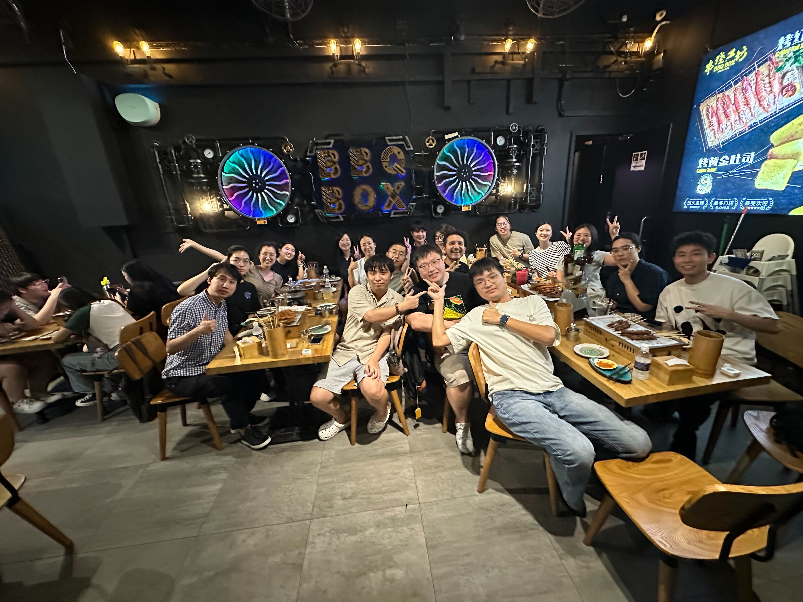

As my one-year visiting at the Urban Analytics Lab (UAL) at the National University of Singapore (NUS) comes to an end, I find myself reflecting on the incredible journey I've had over the past year. Funded by the China Scholarship Council, this opportunity has allowed me to immerse myself in cutting-edge research and collaborate with some of the brightest minds in the field of urban analytics.

During my time at UAL, I focused on leveraging street-level imagery to analyze urban verticality, including vertical 15-minute city concepts, urban slope and more. I had the chance to work on various projects that aimed to enhance our understanding of urban vertical environments through innovative data-driven approaches. One of the highlights of my visit was the collaborative environment at UAL. The lab is a hub of creativity and innovation, where researchers are passionate about making cities smarter and more sustainable. I had the privilege of working alongside Dr. Filip Biljecki and other talented researchers, which greatly enriched my research experience.

As I prepare to leave UAL, I am grateful for the experiences I've gained and the connections I've made. This journey has not only advanced my research but has also deepened my commitment to contributing to the field of urban analytics. I look forward to applying what I've learned at UAL to future projects and collaborations.

